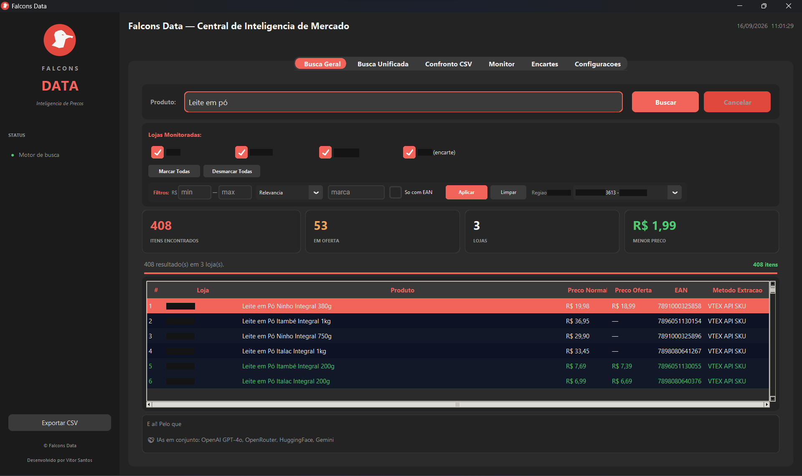
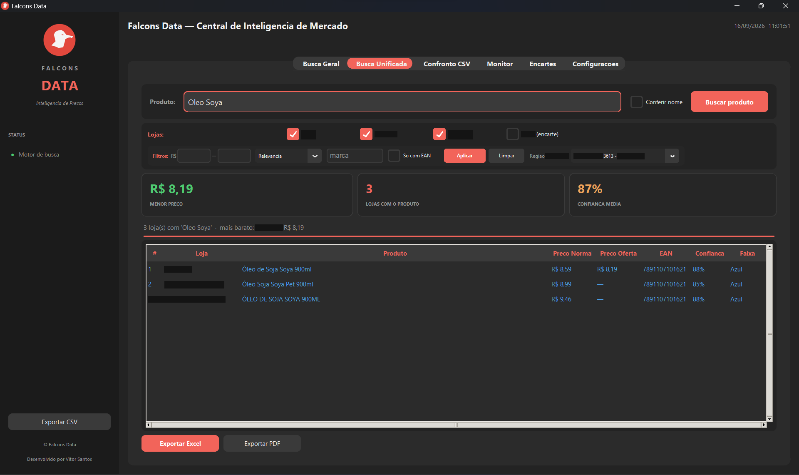
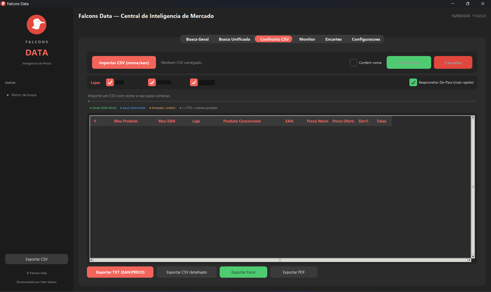
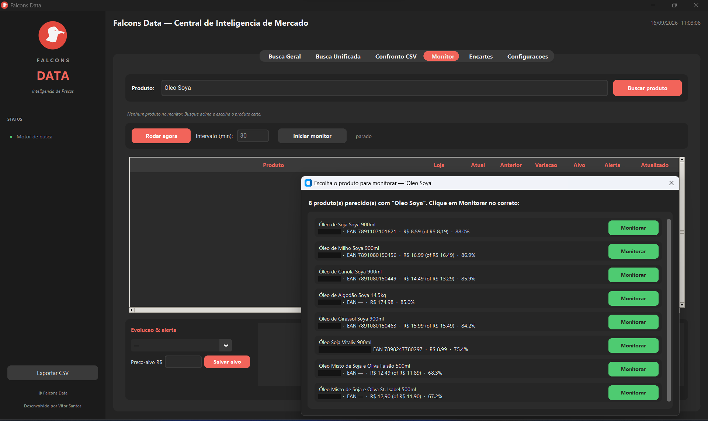
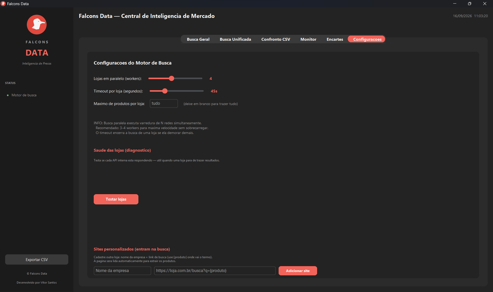

# Price Intelligence Pipeline — Inteligência de Preços da Concorrência

Pipeline em Python assíncrono que coleta, valida e compara os preços praticados por redes varejistas
concorrentes e entrega um resumo comparativo automático — loja mais barata, diferença percentual e
ofertas do dia — apoiado por múltiplos modelos de linguagem (LLM). O projeto nasceu de uma necessidade
real de uma rede de supermercados e evoluiu até um aplicativo desktop com interface gráfica e
empacotamento em executável, permitindo que o time comercial o utilize sem conhecimento técnico.

> **Nota de confidencialidade:** todos os dados presentes neste repositório (planilhas, seeds,
> exemplos) são fictícios, gerados aleatoriamente apenas para demonstração. Os dados reais da operação
> em que o projeto foi utilizado são confidenciais e estão protegidos — nenhum dado real, credencial
> ou informação de terceiros foi incluído aqui.

---

## Visão Geral

A solução automatiza um trabalho que, feito à mão, consome horas e desatualiza no dia seguinte:
levantar o preço da concorrência produto a produto. Ela coleta os preços de mais de uma dezena de
redes (via APIs de catálogo e navegação por categoria), casa cada item com o catálogo próprio pelo
código de barras, persiste o histórico em banco e gera um comparativo pronto para decisão. O resultado
deixa de ser uma planilha manual e passa a ser uma esteira repetível de inteligência de preços.

## Contexto de Negócio

No varejo alimentar, o preço é uma das alavancas mais sensíveis de margem e de competitividade: uma
diferença de poucos centavos em itens de alto giro muda a percepção de "caro ou barato" da loja
inteira e desloca volume entre concorrentes. O problema é que a informação de preço do mercado
envelhece rápido e está espalhada em dezenas de sites e encartes. Quando a área de compras descobre
que ficou cara, a venda já migrou; quando descobre que está barata demais, a margem já foi deixada na
mesa. Este pipeline ataca essa defasagem, transformando a coleta de preços em um processo automático e
diário.

## O Problema que Resolve

- **Auditoria manual de preços** da concorrência: lenta, cara e desatualizada assim que termina.
- **Falta de base para precificar:** decisões de preço tomadas por percepção, não por posição real de mercado.
- **Cobertura limitada:** acompanhar poucas lojas e poucos itens por falta de braço operacional.
- **Casamento de produtos não confiável:** comparar itens diferentes por nome parecido gera decisão errada.

## Público e Decisões Apoiadas

- **Compras e Comercial:** identificam onde estão caros ou baratos frente ao mercado e reagem antes de
  perder venda ou margem.
- **Precificação:** ajusta preço com base em dado observado, priorizando itens de maior impacto.
- **Diretoria:** acompanha o posicionamento de preço da rede frente aos concorrentes ao longo do tempo.

## Impacto e Valor Gerado

- Substitui a auditoria manual de preços (de horas por semana para minutos de execução).
- Dá visibilidade diária dos desvios de preço frente à concorrência, protegendo a margem comercial.
- Amplia a cobertura de monitoramento (mais lojas e mais itens) sem aumentar o esforço humano.
- Reduz o risco de decisão errada ao validar o casamento de produtos por código de barras e IA.

---

## Telas do Aplicativo

O pipeline também é um aplicativo desktop, para o time comercial usar sem ambiente técnico. Cada aba
resolve um problema — abaixo, tela por tela (dados fictícios; nomes das lojas concorrentes ocultados).

### 1. Busca Geral

Busco um produto e o sistema varre todas as lojas monitoradas ao mesmo tempo — preço normal, preço de
oferta, código de barras, em quantas lojas aparece e o menor preço do mercado. Cada linha mostra até o
método de extração usado.



### 2. Busca Unificada

Junta os resultados por loja em um único produto por concorrente, com uma **nota de confiança** de que
achou o produto certo — e não só um parecido. Inclui filtros (faixa de preço, marca, só com EAN,
ordenação) e seleção de região/unidade.



### 3. Confronto CSV

Subo minha lista de produtos (nome + código de barras) e o sistema **casa item a item** com o catálogo
de cada concorrente, classificado por confiança: código bateu (🟢 verde), nome bateu forte (🔵 azul)
ou precisa conferir (🟡 amarelo). Exporta em TXT, CSV, Excel e PDF.



### 4. Monitor

Escolho um produto entre as opções encontradas (cada uma com seu % de confiança) e o sistema
**acompanha o preço ao longo do tempo**, comparando com o valor anterior e avisando quando cruza um
preço-alvo.



### 5. Encartes _(em testes)_

Lê os encartes promocionais dos concorrentes, inclusive em PDF — porque promoção pontual nem sempre
aparece numa busca comum no site.

### 6. Configurações

Ajusto o motor: quantas lojas ele varre em paralelo, tempo limite por loja, e cadastro concorrentes
novos só colando a URL de busca. Tem também um **diagnóstico de saúde das lojas** (🟢/🔴 + latência),
que detecta cedo quando uma fonte interna muda ou cai.



---

## Arquitetura e Abordagem Técnica

```text
Entrada (catálogo próprio + lista de produtos)
      |
      v
Coleta assíncrona (asyncio)  -->  APIs de catálogo (VTEX) + seletores CSS por loja
      |                                   (auto-aprendizado de seletores)
      v
Normalização (produto, loja, preço, oferta)
      |
      +--> Casamento por EAN + similaridade de nome (confirmação por IA quando ambíguo)
      +--> Exportação CSV (resultados_csv/)
      +--> Resumo por IA (Gemini / Groq-Llama / OpenRouter / HuggingFace)
      +--> Banco relacional (sql/schema.sql): dim_produto - dim_loja - fato_preco
```

### Coleta e resiliência
- **Execução assíncrona** (`asyncio`) para paralelizar consultas a várias redes e reduzir o tempo total.
- **Auto-aprendizado de seletores:** quando o layout de um site muda, o pipeline reaprende o seletor
  CSS e o guarda em um cache (`selectors.json`, gerado em runtime, fora do versionamento), reduzindo a
  manutenção manual típica de scrapers.
- **Sites customizados:** o próprio usuário cadastra novas lojas (URL de busca) para entrarem na coleta.

### Qualidade do dado
- **Validação de EAN/GTIN** por checksum GS1, evitando casar produtos diferentes.
- **Casamento por catálogo:** compara o catálogo próprio (CSV) com os itens das redes por EAN e por
  similaridade textual, com **confirmação por IA** nos casos ambíguos.

### Inteligência e entrega
- **Camada multi-LLM** (Gemini, Groq/Llama, GPT-4o-mini via OpenRouter e HuggingFace) que gera um
  resumo curto e acionável: loja mais barata, diferença percentual e ofertas.
- **Exportação em CSV** e **logs estruturados** para rastreabilidade.
- **Aplicativo desktop** (`app_gui.py`) e script de empacotamento em `.exe` (`gerar_executavel.py`),
  permitindo uso pelo time de negócio sem ambiente de desenvolvimento.

### Modelagem de dados (banco relacional)
O arquivo `sql/schema.sql` traz um modelo relacional normalizado (3FN) que representa a saída do
pipeline e permite carregar os CSVs em um banco para análise histórica:
- `dim_produto` (nome, EAN validado), `dim_loja` (própria/concorrente) e `fato_preco`
  (grão: produto x loja x dia).
- View `vw_comparativo_precos`: calcula, para cada produto e dia, o menor preço entre as lojas.

## Stack

Python - asyncio - Web Scraping - APIs REST/JSON - Integração multi-LLM - SQL e modelagem (3FN) -
Interface gráfica (Tkinter) - PyInstaller - logging.

## Como Rodar

```bash
python -m venv .venv && .venv\Scripts\activate   # Windows
pip install -r requirements.txt
copy .env.example .env      # preencha as chaves de API
python pesquisa_preco_v4.py
```

Interface gráfica: `python app_gui.py`. O painel de resultados é apresentado em `index.html`.

## Estrutura do Projeto

```text
pesquisa_preco_v4.py   -> Pipeline principal (coleta assíncrona, casamento, resumo por IA)
app_gui.py             -> Interface gráfica (aplicativo desktop)
gerar_executavel.py    -> Empacotamento em .exe (PyInstaller)
index.html             -> Painel de apresentação dos resultados
sql/schema.sql         -> Modelo relacional (3FN) da saída do pipeline
resultados_csv/        -> Saídas em CSV (exemplo fictício incluído)
.env.example           -> Modelo de variáveis de ambiente (sem segredos)
```

> `selectors.json` e o banco local não são versionados: o primeiro é um cache gerado em runtime; o
> segundo é criado a partir de `sql/schema.sql` no seu ambiente.

## O que este projeto me ensinou

Este projeto virou meu laboratório para pensar como **engenheiro e cientista de dados ao mesmo tempo** —
fazer funcionar quando a fonte muda, o modelo erra e o dado chega sujo.

- **Engenharia de dados** — o pipeline: coletar de fontes instáveis em paralelo sem travar, guardar o
  histórico de preço de forma confiável e usar cache para não reprocessar o que já foi validado.
- **Ciência de dados** — o motor de comparação de produto, construído do zero, capaz de reconhecer que
  "Leite em Pó Ninho 380g" e "Leite Ninho Pó Integral 380 g" são o mesmo item — e o uso de IA em
  consenso para interpretar buscas e, quando a coleta falha, até ler o print da tela.
- **Análise de dados** — decidir o que realmente importa mostrar: todo resultado vem com um nível de
  confiança, porque decisão de preço não pode ser tomada em cima de um match errado.

## Autor

José Vitor Santos Pinheiro — Análise de Dados e Inteligência Comercial (Varejo e Supply Chain).
Contato: vytorsantt@gmail.com
